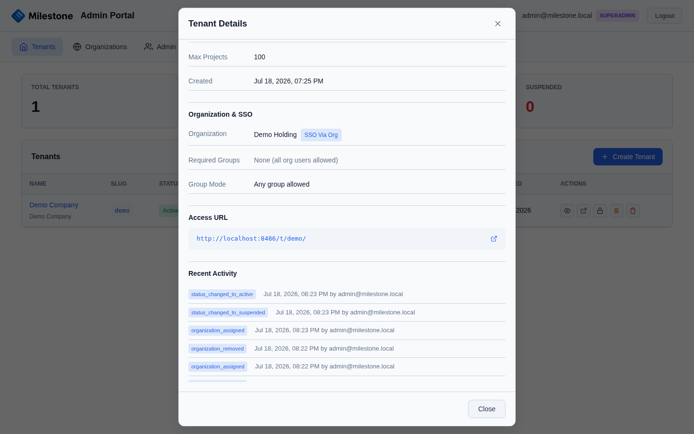

# Monitoring & Troubleshooting

## Health Check

Milestone exposes a health endpoint:

```bash
curl http://localhost:8485/health
```

The Docker container includes a built-in health check that polls this endpoint every 30 seconds.

## Logging

### View Application Logs

```bash
# Docker Compose
docker compose logs -f milestone

# Single container
docker logs -f milestone

# Last 100 lines
docker logs --tail 100 milestone
```

### Log Levels

There is no `LOG_LEVEL` environment variable. Setting `DEBUG=true` enables debug-level behaviour (never use it in production); otherwise the application logs at uvicorn's default level.

## Common Issues

### Frontend changes not appearing

1. Verify the frontend was built: `npm run build` (in `frontend/`)
2. Verify it was deployed: `./deploy-react.sh`
3. Hard refresh the browser: `Ctrl+Shift+R`
4. Check files exist in `public/` and `public/assets/`

### API errors

```bash
# Check backend logs
docker logs milestone

# Test API endpoint
curl http://localhost:8485/health

# View API docs
open http://localhost:8485/api/docs
```

### Container won't start

```bash
# Check logs for errors
docker compose logs

# Rebuild from scratch
docker compose down
docker compose up -d --build
```

### Database connection issues

```bash
# Test connection from container
docker exec milestone python -c "from app.database import engine; print(engine.url)"

# Check environment variables
docker exec milestone env | grep DB

# Test PostgreSQL directly
psql -U milestone -h localhost -d milestone -c "SELECT 1;"
```

### Tenant not accessible

1. Verify the tenant exists and is active in the admin portal
2. Test the database connection from the admin portal
3. Check that the URL matches the slug: `/t/{slug}/`
4. Check backend logs for connection errors

### SSO login fails

1. Verify Azure AD App Registration settings (client ID, tenant ID, secret)
2. Check the redirect URI matches exactly
3. Use the "Test Connection" button in SSO configuration
4. Check browser developer tools for OAuth errors
5. Verify the client secret hasn't expired

### WebSocket disconnections

WebSocket connections require proper proxy configuration:

- nginx: Set `proxy_http_version 1.1` and `Connection "upgrade"` headers
- Cloudflare: Enable WebSockets in the dashboard
- Load balancers: Enable sticky sessions or WebSocket support

## System Statistics (Multi-Tenant)

In multi-tenant mode, the admin portal includes a **System Statistics** panel showing platform-wide metrics:

| Metric | Description |
|--------|-------------|
| **Total Tenants** | Count of all tenants by status (active, suspended, pending, archived) |
| **Active Connection Pools** | Number of database connection pools currently maintained by `TenantManager` |
| **Total Connections** | Sum of active database connections across all tenant pools |
| **System Uptime** | Time since the application process started |
| **Memory Usage** | Current memory consumption of the FastAPI process |
| **Python Version** | Runtime version for troubleshooting |

Access this panel from the admin portal at `/admin/` — it appears on the main dashboard alongside the tenant list.

## Tenant Audit Logging

Every administrative action on tenants is logged for accountability and compliance:

| Action | What's Logged |
|--------|--------------|
| **Tenant created** | Tenant name, slug, who created it |
| **Tenant provisioned** | Database creation result, admin who triggered it |
| **Tenant updated** | Changed fields (name, slug, status), who made the change |
| **Tenant suspended** | Who suspended it and when |
| **Tenant deleted** | Who deleted it and when |
| **Password reset** | Who initiated the reset |

### Viewing Audit Logs

1. In the admin portal, open a tenant's details
2. The **Recent Activity** section shows the most recent entries
3. Each entry includes: timestamp, action type, actor (admin email), and details

{ loading=lazy }

Audit logs are stored in the master database and persist even if a tenant is deleted.

!!! tip
    Audit logs can also be retrieved via the API: `GET /api/admin/tenants/{tenant_id}/audit`

## Performance

### Database Optimization

```bash
# Check slow queries (PostgreSQL)
psql -U postgres -c "SELECT query, mean_exec_time, calls FROM pg_stat_statements ORDER BY mean_exec_time DESC LIMIT 10;"

# Analyze tables
psql -U milestone -d milestone -c "ANALYZE;"

# Check table sizes
psql -U milestone -d milestone -c "SELECT relname, pg_size_pretty(pg_total_relation_size(relid)) FROM pg_catalog.pg_statio_user_tables ORDER BY pg_total_relation_size(relid) DESC;"
```

### Resource Limits

The Docker Compose configurations set resource limits:

- **Memory**: 1 GB limit, 256 MB reservation (app container, `docker-compose.yml`)
- **PostgreSQL**: 512 MB limit, 128 MB reservation (`docker-compose.fresh.yml` only)

Adjust under `deploy.resources` in the compose file you deploy with, if needed.

## Deployment Checklist

Before deploying to production:

- [ ] Set `SESSION_SECRET` to a cryptographically random value
- [ ] Set `TENANT_ENCRYPTION_KEY` (if multi-tenant)
- [ ] Set `SECURE_COOKIES=true` (when serving over HTTPS)
- [ ] Set `DEBUG=false`
- [ ] Configure proper database credentials
- [ ] Set up SSL/TLS via reverse proxy
- [ ] Configure automated database backups
- [ ] Set up log aggregation / monitoring
- [ ] Test health check endpoint
- [ ] Verify WebSocket connections work through the proxy
