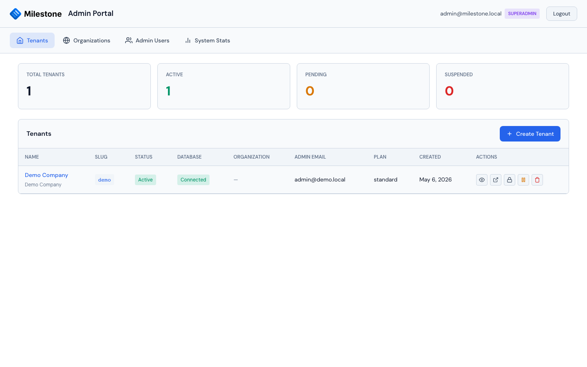
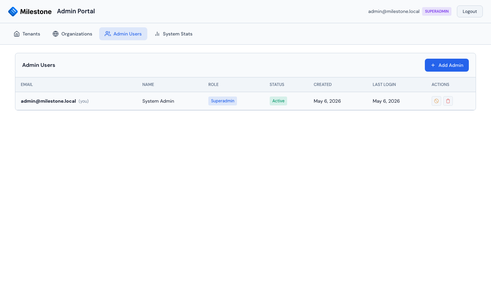
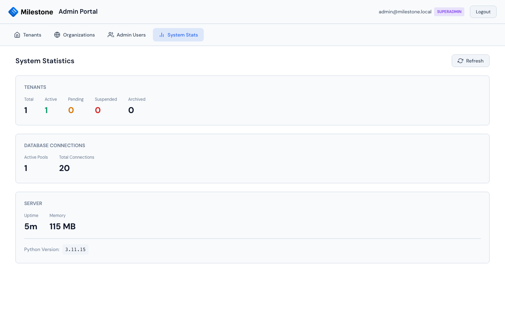

# Multi-Tenant Management

Multi-tenant mode enables SaaS deployment where each organization gets an isolated database. A centralized admin portal at `/admin/` manages the entire platform.

{ loading=lazy }

## Enabling Multi-Tenant Mode

Add these settings to your `.env`:

```bash
# Enable multi-tenant
MULTI_TENANT=true

# Master database (stores tenant registry, admin users, organizations)
MASTER_DB_HOST=localhost
MASTER_DB_PORT=5432
MASTER_DB_NAME=milestone_admin
MASTER_DB_USER=postgres
MASTER_DB_PASSWORD=<master-db-password>

# PostgreSQL admin credentials (for auto-provisioning tenant databases)
# Needs CREATEDB and CREATEROLE privileges
PG_ADMIN_USER=postgres
PG_ADMIN_PASSWORD=<postgres-admin-password>

# Encryption key for tenant database credentials (required!)
# Generate: python -c "import secrets; print(secrets.token_hex(32))"
TENANT_ENCRYPTION_KEY=<64-char-hex-string>
```

The master database schema is auto-applied on startup by `master_db.init_db()`.

## Admin Portal

Access the admin portal at `/admin/`. It has four tabs:

### Tenants

Each tenant represents a separate organization with its own isolated database.

| Action | Description |
|--------|-------------|
| **Create Tenant** | Provision a new tenant database, create initial admin user, generate credentials |
| **View Details** | See tenant metadata, database info, connection status |
| **Show Credentials** | Display generated email/password with copy-to-clipboard |
| **Edit** | Update tenant name, slug, or status |
| **Delete** | Remove a tenant and its database (with confirmation) |
| **Test Connection** | Verify the tenant's database is accessible |

When you create a tenant, the system:

1. Creates a new PostgreSQL database (`milestone_<slug>`)
2. Creates a dedicated database user with restricted permissions
3. Applies the full tenant schema
4. Seeds the database with default settings and an initial admin user
5. Encrypts database credentials using AES-256-GCM
6. Stores the tenant record in the master database

Tenants are accessed via URL pattern: `/t/{slug}/`

### Organizations

Organizations group related tenants and share SSO configuration.

| Action | Description |
|--------|-------------|
| **Create Organization** | Set up with name and admin email |
| **Assign Tenants** | Link tenants to the organization |
| **Configure SSO** | Set up Microsoft Entra ID for the organization |
| **Delete** | Remove organization (tenants are unlinked, not deleted) |

### Admin Users

Admin users have access to the admin portal (separate from tenant application users).

{ loading=lazy }

| Capability | Admin | Superadmin |
|-----------|-------|------------|
| View tenant list | Yes | Yes |
| Create/edit/delete tenants | Yes | Yes |
| Provision tenant databases | Yes | Yes |
| View tenant audit logs | Yes | Yes |
| View organizations | Yes | Yes |
| Configure organization SSO | Yes | Yes |
| Manage admin users | No | Yes |
| View system statistics | Yes | Yes |

- The **Admin Users** tab is only visible to superadmins
- Regular admins can manage tenants and organizations but cannot create or modify other admin accounts

### System Statistics

Overview of the platform deployment — tenant counts by status, database connection pools, server uptime/memory, and Python version.

{ loading=lazy }

## Tenant Database Architecture

```
┌─────────────────────────────────────────────┐
│             Master Database                 │
│           (milestone_admin)                 │
├─────────────────────────────────────────────┤
│  tenants          → Tenant registry         │
│  admin_users      → Admin portal users      │
│  organizations    → Organization groups     │
│  organization_sso → SSO config per org      │
└─────────────────────────────────────────────┘
         │
         ├──── milestone_acme (tenant DB)
         │     ├── users, projects, phases
         │     ├── staff assignments
         │     ├── equipment, bookings
         │     ├── settings, sites, skills
         │     └── vacations, notes, columns
         │
         ├──── milestone_pharma (tenant DB)
         │     └── (same schema, isolated data)
         │
         └──── milestone_biotech (tenant DB)
               └── (same schema, isolated data)
```

### Key Isolation Guarantees

- Each tenant has a **separate PostgreSQL database** — no shared tables
- Each tenant database has a **dedicated database user** with access only to its own database
- Tenant credentials are encrypted at rest with **AES-256-GCM**
- Tenant resolution is URL-based (`/t/{slug}/api/*`) via `TenantMiddleware`
- Cross-tenant data access is architecturally impossible

## Tenant Lifecycle

### Creating a Tenant

1. Log in to the admin portal at `/admin/`
2. Click **Create Tenant**
3. Fill in the tenant name and slug (URL-safe identifier)
4. The system auto-provisions the database
5. Copy the generated credentials from the "Show Credentials" button

### Suspending a Tenant

Edit the tenant and set its status to **Inactive**. The tenant's database remains intact but users cannot log in.

### Deleting a Tenant

!!! danger
    Deleting a tenant drops the entire database. This action is irreversible.

1. Click the delete button on the tenant row
2. Confirm the deletion
3. The system drops the tenant database and removes the record from the master database

### Running Migrations Across Tenants

When schema changes are needed across all tenant databases:

```bash
# Run a migration on all tenant databases
python migrations/run_migration.py <migration_name>

# Run a migration on the master database only
python migrations/run_migration_master.py <migration_name>
```

See [Database & Migrations](database.md) for details.

## Connection Pool Management

The `TenantManager` service manages database connection pools for each active tenant:

- Connection pools are created on-demand when a tenant is first accessed
- Pools are cached and reused for subsequent requests
- Pool size is configurable via `DB_POOL_SIZE` and `DB_POOL_MAX_OVERFLOW` environment variables
- Idle connections are reclaimed automatically

## Security Considerations

| Area | Implementation |
|------|---------------|
| **Data isolation** | Separate PostgreSQL databases per tenant |
| **Credential storage** | AES-256-GCM encryption for tenant DB credentials |
| **Authentication** | Session-based with secure cookies; per-tenant user stores |
| **Authorization** | Role-based (Admin, Superuser, User) within each tenant |
| **SSO** | Microsoft Entra ID configured per organization, shared across org's tenants |
| **Admin access** | Separate admin user store in master database |
