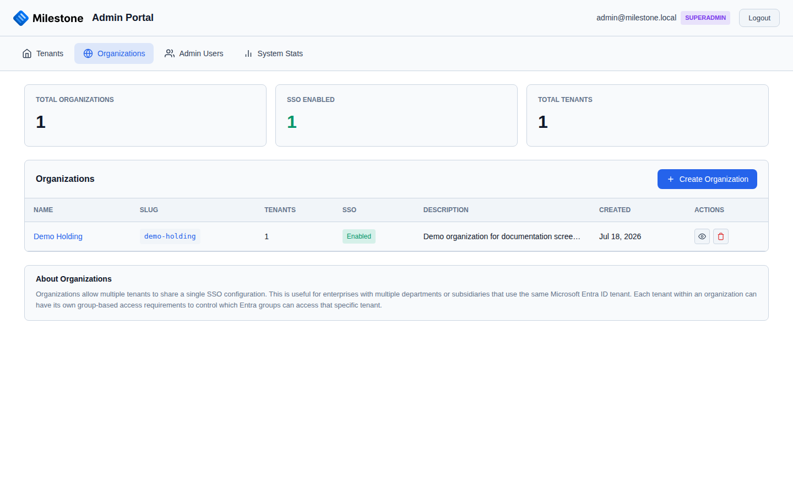
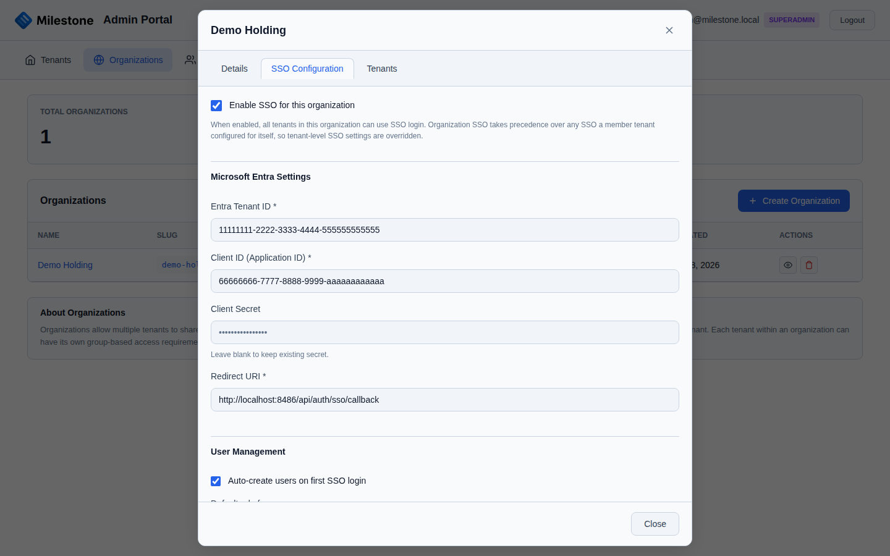
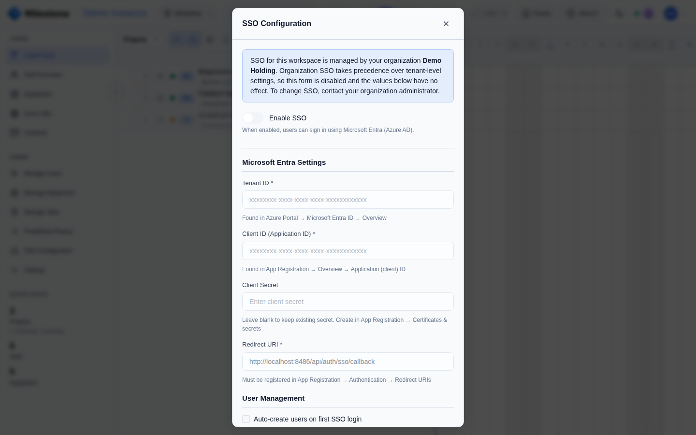

# Organizations & SSO

## Organizations

Organizations group related tenants together and provide shared SSO configuration. For example, a company with separate Milestone instances for different departments can share a single Microsoft Entra ID setup.

{ loading=lazy }

### Creating an Organization

1. Go to the **Organizations** tab in the admin portal
2. Click **Create Organization**
3. Enter the organization name and admin email
4. Click **Create**

### Assigning Tenants

After creating an organization, assign tenants to it:

1. Edit the organization
2. Select tenants from the dropdown
3. Save changes

Tenants inherit the organization's SSO configuration automatically.

## Microsoft Entra ID (SSO)

Milestone supports enterprise SSO through Microsoft Entra ID (formerly Azure AD).

### Prerequisites

- An Azure AD tenant
- An App Registration in Azure AD
- A client secret for the App Registration
- The redirect URI configured in Azure AD
- Outbound HTTPS access from the Milestone **server** to `login.microsoftonline.com` and
  `graph.microsoft.com` (see [Network & Firewall Requirements](installation.md#network-firewall-requirements))

### Redirect URI

Milestone uses a **single, shared callback URL** for all SSO sign-ins:

```
https://your-domain.com/api/auth/sso/callback
```

!!! important "One redirect URI for the whole organization"
    Do **not** add the tenant path (`/t/{slug}/...`) to the redirect URI. Milestone carries
    the tenant through the sign-in flow internally, so this one URL works for **every**
    tenant in the organization. Register it once per App Registration and reuse it — you do
    not need a separate redirect URI per tenant.

    Use the same value in three places: the Azure App Registration, the **Redirect URI**
    field in Milestone's SSO configuration, and (single-tenant only) `SSO_REDIRECT_URI`.
    They must match exactly.

### Azure AD App Registration

1. Go to [Azure Portal](https://portal.azure.com) > Azure Active Directory > App Registrations
2. Click **New Registration**
3. Set the redirect URI (platform **Web**) to: `https://your-domain.com/api/auth/sso/callback`
4. Under **Certificates & secrets**, create a new client secret
5. Note the **Application (client) ID**, **Directory (tenant) ID**, and the client secret value

### Configuring SSO in Milestone

SSO can be configured at two scopes:

**Per-Organization (Multi-Tenant):**

1. In the admin portal, go to the **Organizations** tab
2. Click the SSO configure button on the organization
3. Enter:
   - **Client ID** — Application (client) ID from Azure
   - **Tenant ID** — Directory (tenant) ID from Azure
   - **Client Secret** — The secret value
   - **Redirect URI** — `https://your-domain.com/api/auth/sso/callback` (the shared URL above)
4. Save configuration

{ loading=lazy }

All tenants in the organization share this SSO setup.

**Per-Tenant (Multi-Tenant):**

A tenant that does **not** belong to an organization can configure its own SSO from the
**SSO Configuration** screen inside the application (admin only), using the same fields and
the same shared redirect URI.

!!! note "Organization SSO takes precedence"
    If a tenant belongs to an organization that has SSO enabled, the organization's
    configuration always applies and the tenant-level SSO form is shown read-only — a
    per-tenant configuration would be ignored. To configure SSO per tenant, remove the
    tenant from the organization (or disable the organization's SSO).

{ loading=lazy }

**Per-Instance (Single-Tenant):**

Configure SSO in the Settings modal within the application, or set environment variables:

```bash
SSO_ENABLED=true
SSO_CLIENT_ID=your-azure-app-client-id
SSO_CLIENT_SECRET=your-azure-app-client-secret
SSO_TENANT_ID=your-azure-tenant-id
SSO_REDIRECT_URI=https://your-domain.com/api/auth/sso/callback
```

### SSO Login Flow

1. User clicks **Sign in with Microsoft** on the login screen
2. Redirected to Microsoft's login page
3. After authentication, redirected back to Milestone with an authorization code
4. Milestone exchanges the code for tokens and creates/updates the user session
5. If the user doesn't exist in Milestone, their account is automatically created

### Testing SSO

After saving the configuration, verify it end to end: open a tenant's login page and click
**Sign in with Microsoft**. You should be redirected to Microsoft, and after signing in,
returned to that tenant's workspace. If sign-in fails on the return trip, you are sent back
to that tenant's own sign-in page with the reason shown above the form — start there. The
most common cause is a redirect-URI mismatch — confirm the App Registration, Milestone's
**Redirect URI** field, and (single-tenant) `SSO_REDIRECT_URI` all read exactly
`https://your-domain.com/api/auth/sso/callback`. The server log carries the underlying
Microsoft error for every failure.

## Group-Based Access Control

Restrict tenant access to users who belong to specific Microsoft Entra ID (Azure AD) security groups.

### How It Works

1. In the admin portal, edit a tenant
2. Under **Group Restrictions**, add one or more **Azure AD Group IDs** (GUIDs from your Entra directory)
3. Choose the **membership mode**:
   - **Any** (default) — User must belong to **at least one** of the listed groups
   - **All** — User must belong to **every** listed group
4. Save the tenant configuration

When a user logs in via SSO, Milestone fetches their group memberships from the Microsoft Graph API and validates them against the tenant's requirements. If the user doesn't meet the group criteria, access is denied.

!!! warning "Grant GroupMember.Read.All first"
    Reading group memberships requires the **GroupMember.Read.All** (or
    **Directory.Read.All**) Microsoft Graph permission on the App Registration,
    with **admin consent granted**. Without it the group lookup fails for every
    user, and sign-in reports *"Could not verify group membership. Contact
    administrator."* Add the permission under **API permissions > Add a
    permission > Microsoft Graph > Delegated permissions**, then click
    **Grant admin consent**. Leave the group list empty if you don't need
    group-based restrictions — the lookup is then skipped entirely.

### Finding Azure AD Group IDs

1. Go to [Azure Portal](https://portal.azure.com) > Azure Active Directory > Groups
2. Click on the group you want to use
3. Copy the **Object ID** (a GUID like `a1b2c3d4-e5f6-7890-abcd-ef1234567890`)

### Use Cases

- **Department isolation** — Only R&D department members can access the R&D tenant
- **Project-based access** — Create an Azure AD group per project team and restrict the tenant accordingly
- **Compliance** — Ensure only authorized personnel can access sensitive project data

!!! note
    Group-based access control requires SSO to be configured. It has no effect on local (email/password) authentication.
