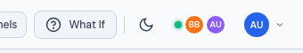
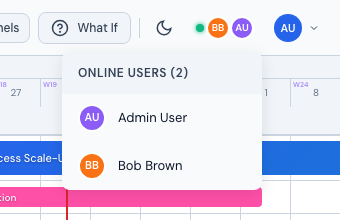
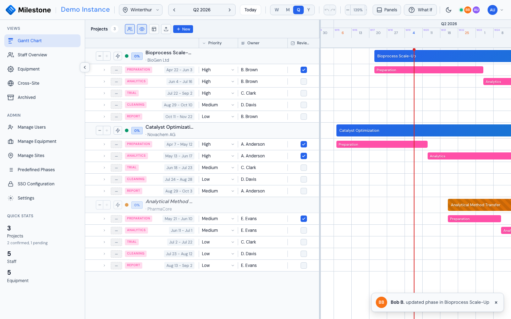

# Real-Time Collaboration

Milestone Planner includes real-time collaboration features so teams can see who else is active, receive live change notifications, and avoid conflicting edits.

## Online Users

The **Online Users** indicator in the header shows how many users are currently connected, as a stack of colored avatars next to a green status dot. This uses a WebSocket connection that updates automatically — when someone opens or closes Milestone, the list refreshes in real-time.

{ loading=lazy }

Hover the avatar stack to open a dropdown listing every connected user by name:

{ loading=lazy }

## Presence Tracking

When you open a project, Milestone sends a heartbeat every 30 seconds to let others know you're actively viewing or editing. The Online Users dropdown reflects who is currently connected; presence records on the backend (`/api/presence/...`) capture per-project viewing and editing state, which is used internally for change-broadcast routing and conflict detection.

Presence is tracked per project, so multiple users can work on different projects simultaneously without interference.

## Conflict Detection

Before saving changes (such as moving a phase or updating assignments), Milestone checks for potential conflicts:

- **Active editors** — If another user is currently editing the same project, you'll see a warning listing who else is editing
- **Recent modifications** — If the project was modified since you last loaded it, a warning shows who made the last change and when

This prevents two users from unknowingly overwriting each other's work.

## Live Change Notifications

When another user modifies a phase, subphase, or assignment, a toast appears in the bottom-right corner via WebSocket. Cascaded changes from the same user are coalesced into a single toast within a short window (e.g. *"Bob B. made 2 changes in Bioprocess Scale-Up"*).

{ loading=lazy }

Toasts appear for about 6 seconds before fading. The notification includes the user's avatar, name, and a summary of what changed.

## WebSocket Connection

The real-time features use a WebSocket connection that:

- **Auto-connects** when you log in
- **Reconnects automatically** if the connection drops (with exponential backoff, up to 5 attempts)
- **Maintains a keepalive** ping every 25 seconds to prevent timeouts
- **Gracefully degrades** — if WebSocket is unavailable (e.g., behind a restrictive proxy), the app continues to work normally; you just won't see live updates from other users

The connection status is visible in the Online Users indicator: a connected state shows the user count, while a disconnected state shows a fallback icon.

!!! note
    WebSocket connections require proper proxy configuration. If you're behind nginx or a load balancer, ensure WebSocket upgrade headers are passed through. See the [Installation guide](../admin-guide/installation.md) for reverse proxy configuration examples.

## Best Practices

- **Check online users** before making major changes — if someone else is editing the same project, coordinate with them
- **Pay attention to conflict warnings** — they appear before you save and help prevent lost work
- **Refresh if needed** — if you've been idle for a long time, refresh the page to get the latest data before editing
