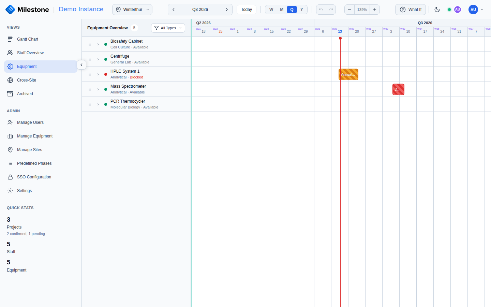
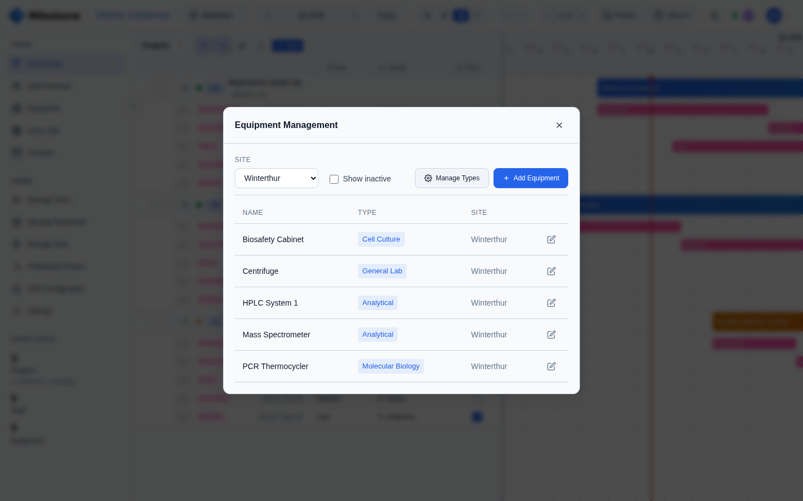
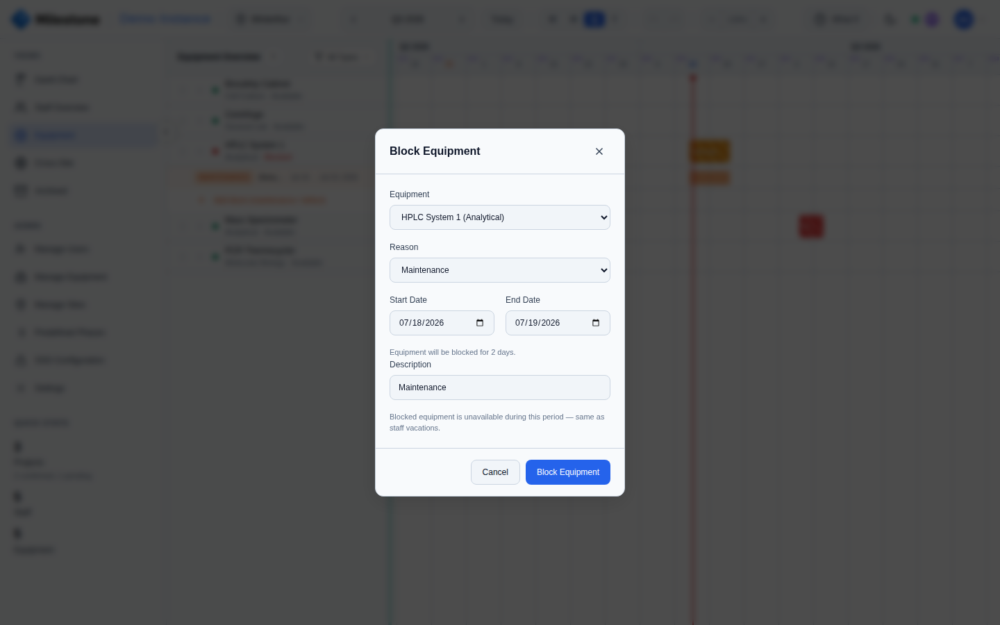

# Equipment Booking

The **Equipment View** provides a timeline for tracking equipment availability and bookings across projects. It can be accessed from the sidebar or embedded below the main Gantt chart via the **Panels** toggle.

{ loading=lazy }

!!! tip
    Admins and superusers can dock the Equipment view directly below the Gantt chart via the **Panels** button — see [Resource Panels](gantt-charts.md#resource-panels).

## Equipment List Panel

The left panel lists all equipment items for the selected site with:

- **Status indicator**: Green dot (available) or Red dot (currently booked)
- **Equipment name**: Primary identifier
- **Type and status**: Equipment type badge and "In use" / "Available" label
- **Drag handle**: Admins and Superusers can drag equipment onto the Gantt timeline to create bookings

The panel is resizable — drag the divider between the panel and timeline (200px–500px).

## Equipment Timeline

The right side shows a horizontal timeline with booking bars:

- Bars are **color-coded by project** for easy identification
- Multiple bookings can overlap on the same equipment, displayed as stacked bars
- Click any booking bar to edit the assignment (dates, equipment)
- Timeline zoom and date navigation sync with the main Gantt chart when embedded

## Booking Equipment

### Method 1: Drag & Drop

1. Grab an equipment item by the drag handle in the Equipment panel
2. Drag it onto a project or phase bar on the Gantt timeline
3. The Equipment Assignment Modal opens pre-filled with the target project/phase dates

### Method 2: Context Menu

1. Right-click on a project, phase, or subphase in the Gantt chart
2. Select **Assign Equipment**
3. The Equipment Assignment Modal opens

### Assignment Modal

- Select the **equipment item** from a dropdown
- Set **start and end dates** for the booking
- Click **Save** to confirm

## Filtering by Type

Click the **filter button** in the Equipment panel header to filter by equipment type:

1. A dropdown shows all available types as checkboxes
2. Check types to show (e.g., Analytical, Pilot Plant, Safety)
3. Use **Select All** / **Clear** for quick selection
4. The filter button shows the active count when filtering (e.g., "3 types")

## Managing Equipment

Open the **Equipment Management** modal from the sidebar admin section (Admins and Superusers only).

{ loading=lazy }

### Adding Equipment

1. Click **Add Equipment**
2. Fill in:
   - **Name** (required, e.g., "Pilot Plant A", "Mass Spec 1")
   - **Type** — select an existing type or click **+ New type** to create one inline
   - **Site** (required) — select which site the equipment belongs to
3. Click **Create Equipment**

### Editing Equipment

1. Click the **edit icon** on an equipment row
2. Modify the name, type, description, or active status
3. Click **Save Changes**

Setting equipment to **inactive** removes it from booking lists and the Equipment View. Inactive equipment and their existing bookings are preserved.

### Deleting Equipment

Click **Delete Equipment** in the edit form. A confirmation dialog warns that all assignments for the equipment will also be removed. This action is irreversible.

### Equipment Types

Types are managed via the **Manage Types** button in the Equipment Management modal. See [Settings — Equipment Types](settings.md#equipment-types) for details on creating, renaming, and deleting types.

## Maintenance Blocks

Equipment blocks mark a period when an item is **unavailable for booking** — typically due to maintenance, calibration, defect, or another planned outage. Blocks behave like vacations for equipment: they appear on the Equipment Timeline and are honoured by overlap detection so you don't accidentally schedule a project during a downtime window.

### Creating a Block

1. Right-click the equipment row (or an existing booking) on the Equipment Timeline and select **Block Equipment**, *or* open the Equipment panel and use the block action on the equipment item.
2. The Equipment Block modal opens. Fill in:
    - **Equipment** (required) — defaults to the row you clicked from
    - **Start date** and **End date** (required, inclusive)
    - **Reason** — *Maintenance*, *Defect / Out of order*, *Calibration*, or *Other*
    - **Description** — short free-text label, prefilled from the chosen reason (e.g. *"Annual recalibration"*)
3. Click **Save Block**.

{ loading=lazy }

The duration is shown live as you change dates so you can confirm the window before saving.

### Editing or Deleting a Block

- Click an existing block on the Equipment Timeline to open the modal in edit mode.
- Adjust dates, reason, or description and click **Save Block**.
- Click **Delete Block** to remove it. There is no soft-delete — the block disappears immediately and the equipment becomes bookable again on those dates.

### How Blocks Affect Availability

- Block bars are styled distinctly from project bookings on the Equipment Timeline (typically a hatched or muted fill) so they're easy to distinguish.
- The equipment status indicator in the Equipment panel reflects the block — an item is shown as *In use* when its current date falls inside an active block, even with no project booking.
- When you create a new equipment assignment that overlaps a block, an overlap warning is shown (the assignment is still allowed — the warning is informational so you can resolve the conflict deliberately).

### Permissions

Only **Admins** and **Superusers** can create, edit, or delete equipment blocks. Regular users see them on the timeline but cannot modify them. Superusers are limited to equipment on sites they have access to.

## Permissions

| Action | Admin | Superuser | User |
|--------|-------|-----------|------|
| View equipment & bookings | Yes | Yes | Yes |
| Assign equipment to projects | Yes | Yes | No |
| Add/edit/delete equipment | Yes | Yes (own sites only) | No |
| Manage equipment types | Yes | Yes | No |
| Create/edit equipment blocks | Yes | Yes (own sites only) | No |
