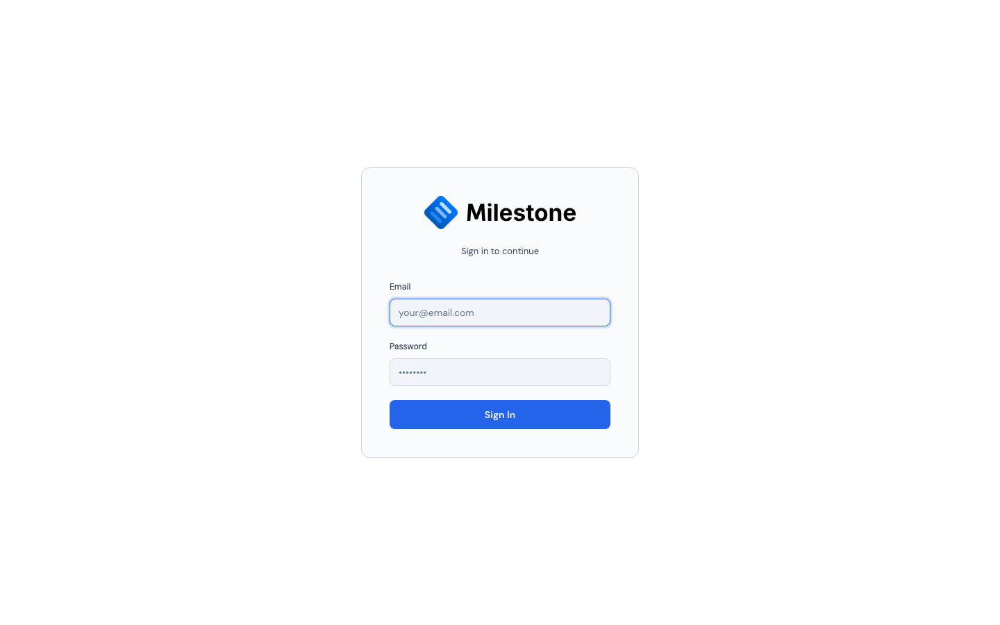

# Getting Started

## Logging In

When you navigate to the application URL, you are presented with the login screen.

{ loading=lazy }

- Enter your **email** and **password**, then click **Sign In**.
- If your organization uses **Microsoft Entra ID (SSO)**, click **Sign in with Microsoft** to authenticate through your corporate identity provider. The SSO button only appears if configured by your administrator.

## The Main Interface

The application is organized into several areas:

- **Sidebar** (far left) — Switch between the five main views: Gantt Chart, Staff Overview, Equipment, Cross-Site, and Archived
- **Header** (top) — Branding, site selector, date navigation, zoom controls, theme toggle, and user menu
- **Project Panel** (left-center) — Hierarchical list of projects, phases, and subphases
- **Timeline** (right) — Visual Gantt bars aligned to a calendar

## Navigation

### Sidebar Views

| Icon | View | Description |
|------|------|-------------|
| Gantt | **Gantt Chart** | Project timeline with phases and resource assignments (default) |
| Staff | **Staff Overview** | Staff members with assignments and availability |
| Equipment | **Equipment** | Equipment items with booking timelines |
| Cross-Site | **Cross-Site** | Overview of projects across all sites |
| Archive | **Archived** | Completed/archived projects |

The sidebar can be collapsed to icon-only mode for more screen space. Administrators see additional **Admin** links for user management, site management, and configuration.

### Header Controls

**Left — Branding & Context:**

- Logo and instance title (customizable by admin)
- Site selector dropdown to switch between locations

**Center — Timeline Navigation:**

- Arrow buttons to scroll the timeline backward/forward
- **Today** button to jump to the current date
- View mode: **W** (Week), **M** (Month), **Q** (Quarter), **Y** (Year)
- Zoom slider to adjust timeline cell width (12px to 120px)

**Right — Actions & User Menu:**

- **Panels** toggle — Show/hide Staff and Equipment panels below the Gantt chart
- **What-If** toggle — Enter/exit scenario planning mode
- Theme toggle (light/dark)
- Online users indicator
- User menu (profile, settings, admin portal, logout)

## User Roles

| Role | Permissions |
|------|-------------|
| **Admin** | Full access: manage users, sites, settings, projects, assignments |
| **Superuser** | Manage projects and assignments, use What-If mode; cannot manage users or settings |
| **User** | View-only access to projects and timelines |
