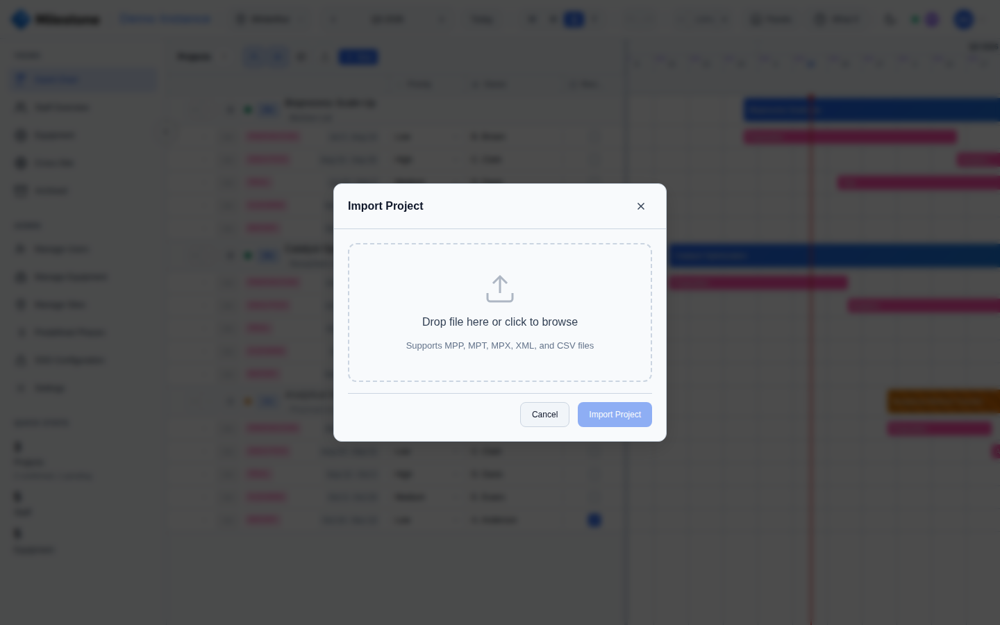

# Import & Export

## Importing Projects

{ loading=lazy }

Milestone can import project data from external tools:

1. Click **Import** in the project panel header
2. Drag-and-drop or browse to select a file:
   - **CSV** — Comma-separated values with columns for project name, phases, dates
   - **XML** — Microsoft Project XML format (`.xml`)
   - **MPP/MPT/MPX** — Microsoft Project native format (requires Java on the server)
3. Milestone parses the file and shows a preview
4. Click **Import Project** to create the project with all phases and subphases

After import, a summary shows the created project, phase count, and subphase count.

### Supported Formats

| Format | Extension | Requirements | Notes |
|--------|-----------|-------------|-------|
| **CSV** | `.csv` | None | Simple comma-separated values with project name, phase names, start/end dates |
| **XML** | `.xml` | None | Microsoft Project XML format — preserves full hierarchy and metadata |
| **MPP** | `.mpp` | Java (JRE 11+) | Microsoft Project native binary format — richest data preservation |
| **MPT** | `.mpt` | Java (JRE 11+) | Microsoft Project template format |
| **MPX** | `.mpx` | Java (JRE 11+) | Older Microsoft Project exchange format |

!!! note
    MPP/MPT/MPX file import requires Java to be installed on the server (included in the Docker image). CSV and XML imports work without Java.

!!! note
    Importing is blocked while [What-If mode](what-if-planning.md) is active — imports create the project immediately on the server and cannot be sandboxed. Exit What-If mode first.

### What Gets Imported

- **Project name** and metadata (start date, end date)
- **Phase hierarchy** — top-level tasks become phases, nested tasks become subphases (unlimited nesting depth preserved)
- **Dates** — start and end dates for all phases and subphases
- **Task names** — preserved as phase/subphase names

Staff assignments, resource allocations, and custom fields from the source file are not imported — these are configured within Milestone after import.

### Troubleshooting Import Issues

| Problem | Solution |
|---------|----------|
| MPP import fails with "Java not found" | Java (JRE 11+) must be installed on the server. The Docker image includes it, but local development may not. |
| Phases appear flat (no nesting) | The source file may not have task hierarchy. Check the WBS structure in Microsoft Project before exporting. |
| Dates look wrong | Ensure the source file uses date formats that can be parsed (ISO 8601 or standard regional formats). |
| Large file takes too long | Very large project files (hundreds of tasks) may take several seconds to parse. Be patient during the preview step. |

## Exporting Projects

To export a project:

1. Open the project edit modal (click Edit or right-click then Edit)
2. At the bottom of the modal, two export buttons are available:
   - **CSV Export** — Compatible with Microsoft Project and spreadsheet tools
   - **XML Export** — Microsoft Project XML format

The exported file includes the project hierarchy (phases, subphases), dates, assignments, and custom column values.

## Site Excel Export

The **Site Excel Export** is a complete snapshot of everything that lives under one site — projects, users, equipment, skills, vacations, assignments, custom columns, bank holidays, and company events — bundled into a single multi-sheet `.xlsx` file. It is the canonical "everything for this site" backup format, useful for archiving, audit, or migration.

### How to Export

1. Open the **Manage Sites** modal from the sidebar admin section.
2. Locate the site you want to export.
3. Click the **download icon** (↓) next to the edit/pencil icon. Hover tooltip: *"Export site data as Excel"*.
4. The browser downloads `site_<name>_<YYYY-MM-DD>.xlsx`. Large sites may take several seconds to generate — the icon shows a spinner while the export is being built server-side.

{ loading=lazy }

### What's in the File

Each kind of data lives on its own sheet, so the file opens cleanly in Excel, LibreOffice, or any spreadsheet tool:

| Sheet | Contents |
|---|---|
| **Site** | Site metadata: name, city, country, region code, active flag |
| **Projects** | All projects on the site with their phases and subphases (full hierarchy, dates, project manager, customer, completion %) |
| **Users** | Users assigned to this site (name, email, role, job title, active flag) |
| **Equipment** | Equipment items at the site, with type and active status |
| **Skills** | Skills defined on the instance (name, color, description) |
| **User skills** | User → Skill associations |
| **Tags** | Project tag definitions (name, color) |
| **Project tags** | Project → Tag associations |
| **Vacations** | All vacation entries for users on this site, including recurring patterns |
| **Project assignments** | Staff assigned at the project level |
| **Phase assignments** | Staff assigned at the phase level (with allocation %) |
| **Subphase assignments** | Staff assigned at the subphase level |
| **Equipment assignments** | Equipment booked against projects/phases/subphases |
| **Custom columns** | Custom column definitions for this site (name, type, scope, options) |
| **Custom column values** | Custom column values for every project/phase/subphase |
| **Bank holidays** | Public and custom holidays on the site (with year) |
| **Company events** | Company events configured for the site |
| **Equipment blocks** | Maintenance/unavailability windows on the site's equipment |
| **Staff notes** | Notes pinned to the site's staff timeline |

!!! note
    The Site Excel Export is restricted to **Admins and Superusers**. Superusers can only export sites they belong to — Admins can export any site.

!!! tip
    Use this export before doing destructive operations (e.g. deleting a site, large bulk edits). The file is small enough to keep alongside regular database backups and is human-readable without needing to restore.
