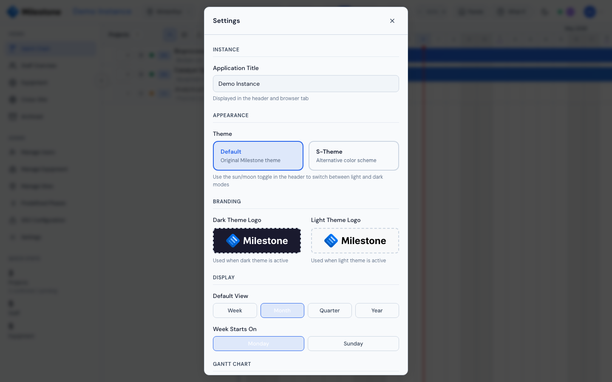
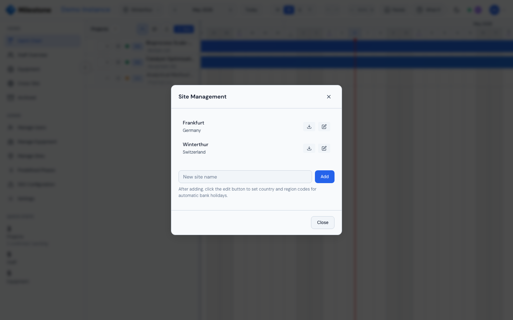
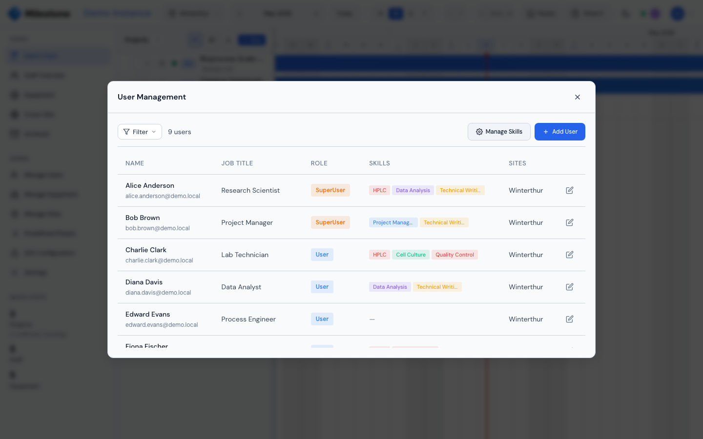
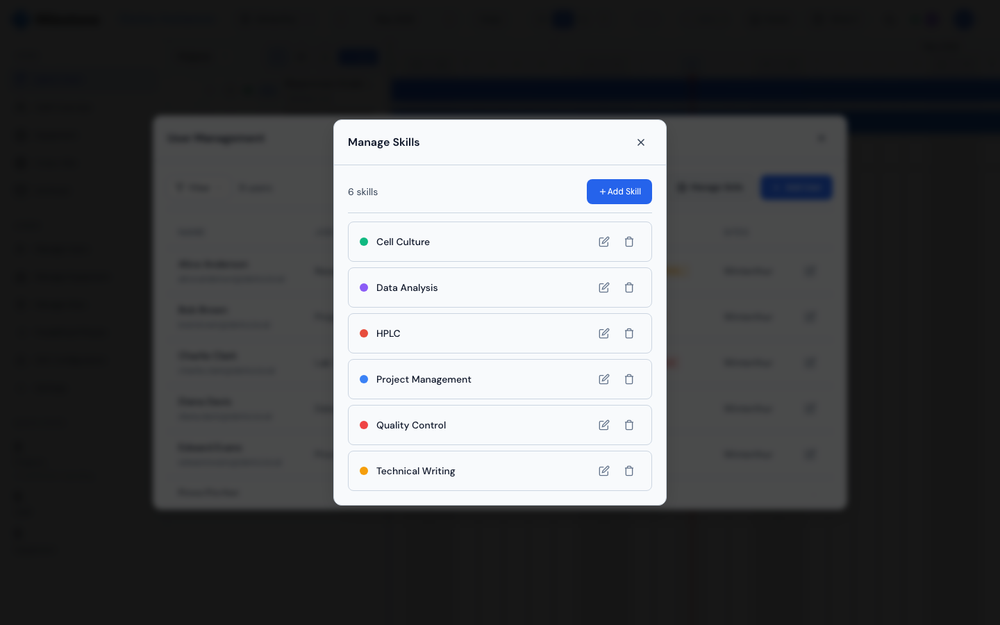
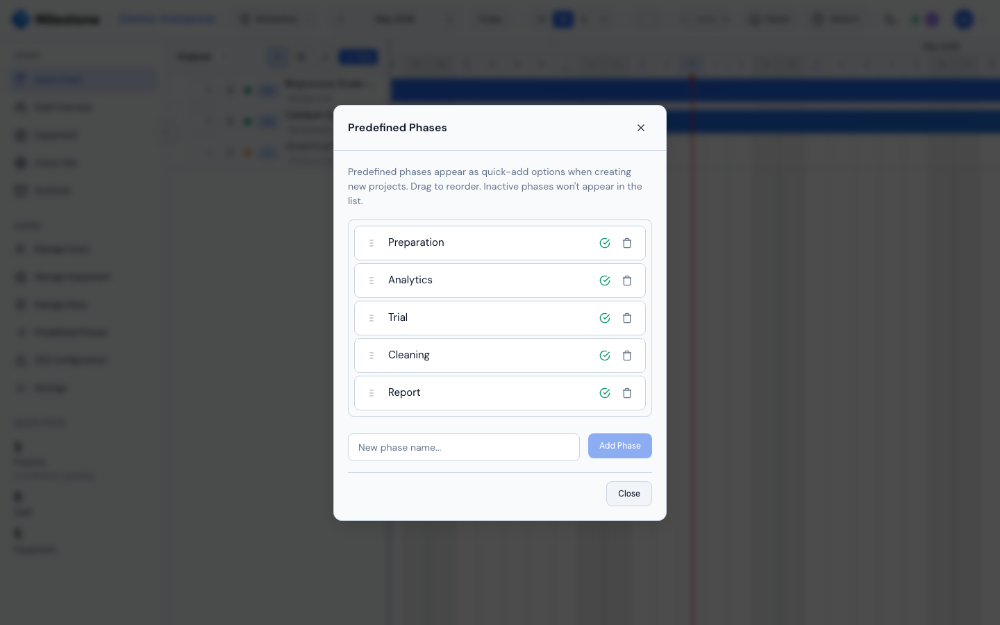

# Settings & Configuration

Access settings through the gear icon in the sidebar or through the user menu. Most settings require Admin role.

{ loading=lazy }

## Instance Settings

- **Application Title** — Name displayed in the header and browser tab (e.g., "ACME R&D Planner")

## Branding & Themes

- Choose from available **theme families** (color schemes)
- Toggle **light/dark mode** using the sun/moon icon in the header
- Upload custom logos for dark and light themes (drag-and-drop or click to browse)
- Click **Remove** to revert to the default Milestone logo

## Display Settings

| Setting | Description |
|---------|-------------|
| Default View | Initial timeline granularity: Week, Month, Quarter, or Year |
| Week Starts On | Monday or Sunday |
| Show Weekends | Toggle weekend columns on/off |
| Auto-expand Projects | Automatically expand all projects on load |

---

## Site Management

Sites represent your organization's physical locations. Projects, staff, equipment, and holidays are all scoped to sites. Click **Manage Sites** in the admin section of the sidebar to open site management.

{ loading=lazy }

### Creating a Site

1. Open the **Manage Sites** modal from the sidebar
2. Enter a site name in the text field (e.g., "Winterthur HQ")
3. Click **Add** — the site is created with minimal fields
4. Click the **edit icon** (pencil) on the new site to open the full edit modal

### Editing a Site

The site edit modal has these fields:

| Field | Description | Example |
|-------|-------------|---------|
| **Site Name** | Display name (required, must be unique) | Winterthur HQ |
| **City** | City location | Winterthur |
| **Country** | Country from grouped dropdown (Europe, Americas, Asia & Pacific, Africa & Middle East) | Switzerland (CH) |
| **Region/State Code** | Sub-region for holiday filtering — varies by country | ZH (Zurich), HE (Hesse), BY (Bavaria) |
| **Active** | Checkbox — inactive sites are hidden from the site selector | Checked |

!!! tip
    Setting the **Country** enables automatic bank holiday fetching. Adding a **Region/State Code** filters holidays to your specific region (e.g., canton-specific holidays in Switzerland).

### Site Selector

The **site selector** dropdown in the header filters everything to the selected site:

- Projects visible on the Gantt chart
- Staff in the Staff Overview
- Equipment in the Equipment View
- Bank holidays and company events on the timeline
- Custom columns

Admins see all sites. Regular users only see sites they are assigned to.

### Deleting a Site

Delete a site from the Manage Sites modal. This cascades to remove all associated projects, equipment, holidays, and company events.

!!! danger
    Deleting a site is irreversible and removes all data associated with it.

---

## Bank Holidays

Bank holidays are configured **per site** and affect staff availability calculations. They appear as highlighted columns on the Gantt and Staff timelines.

### Automatic Fetching

If a site has a **country** set, Milestone can auto-fetch public holidays from the [Nager.Date API](https://date.nager.at/):

1. Edit a site and set its **Country** (and optionally **Region/State Code**)
2. Click **Save Changes**
3. Open the **Bank Holidays** modal (accessible from the Staff View or site edit)
4. Click **Refresh** — Milestone fetches public holidays for the current and next year
5. If a region code is set, only region-specific holidays are included

The last refresh timestamp is shown in the site edit modal: *"Last updated: April 2026"*.

!!! note "Behind a corporate firewall?"
    Fetching holidays is an outbound call from the Milestone **server** to `date.nager.at`.
    If your network blocks server-to-internet traffic, ask your administrator to allow it —
    see [Network & Firewall Requirements](../admin-guide/installation.md#network-firewall-requirements).
    Everything else keeps working if it's blocked; the site just won't have imported holidays.

### Viewing and Managing Holidays

Open the **Bank Holidays** modal to see all holidays for the current site:

- Use the **year dropdown** to switch between years (current -1 to current +2)
- Holidays are split into two sections:
    - **Public Holidays** — auto-fetched from Nager.Date (read-only, cannot be deleted individually)
    - **Custom Holidays** — manually added (can be deleted with the × button)

### Adding a Custom Holiday

1. Click **Add Custom** in the Bank Holidays modal
2. Enter the **holiday name** (e.g., "Company Anniversary")
3. Set the **start date** (required)
4. Optionally set an **end date** for multi-day holidays
5. Click **Add**

Custom holidays are site-specific and appear alongside auto-fetched public holidays.

### Exporting Holidays to Calendar

Click **Export ICS** to download an `.ics` calendar file containing all holidays for the selected year. Import this into Outlook, Google Calendar, or any calendar app to sync holidays to your personal calendar.

### How Holidays Affect the Timeline

- Holiday dates appear as **shaded columns** on the Gantt timeline
- Staff availability is reduced on holiday dates — they are **not counted as working days**
- The Staff View shows holiday labels in the timeline header

!!! note
    Only **Superusers and Admins** can add/delete custom holidays and refresh from the API. Regular users can view holidays but not modify them.

---

## Company Events

Company events are organization-wide dates shown as labeled markers on the Staff View timeline (e.g., "ISO Audit", "All-Hands Meeting", "Annual Retreat").

### Adding a Company Event

1. Open the **Company Event** modal (from the Staff View or settings)
2. Enter the **event name** (e.g., "ISO Audit")
3. Set the **start date** (required)
4. Optionally set an **end date** for multi-day events
5. Click **Add Event**

### How Events Appear

- Company events display as **red markers** on the Staff Overview timeline
- They are informational only — unlike bank holidays, they **do not affect working day calculations** or staff availability
- Events are visible to all users on the selected site

### Deleting a Company Event

In the Staff View, click the delete button on a company event to remove it (requires Superuser role).

---

## User Management

Administrators can create, edit, and deactivate user accounts. Open **User Management** from the sidebar admin section.

{ loading=lazy }

### User Fields

| Field | Description |
|-------|-------------|
| **Email** | Login email address (unique) |
| **First Name** / **Last Name** | Display name |
| **Job Title** | Role description shown in staff lists. Free-text with autocomplete suggestions — see [Job Title Suggestions](#job-title-suggestions) |
| **Role** | Admin, Superuser, or User (see below) |
| **Sites** | One or more sites the user can access |
| **Skills** | Tags for resource planning (see Skills Management below) |
| **Active** | Deactivate to prevent login without deleting |

### User Roles

| Permission | Admin | Superuser | User |
|-----------|-------|-----------|------|
| View projects & timeline | Yes | Yes | Yes |
| Create/edit/delete projects | Yes | Yes | No |
| Manage staff assignments | Yes | Yes | No |
| Manage equipment assignments | Yes | Yes | No |
| Enter What-If mode | Yes | Yes | No |
| Add custom holidays / events | Yes | Yes | No |
| Manage users & settings | Yes | No | No |
| Manage sites | Yes | No | No |

### Filtering Users

The user management table supports filtering by:

- **Status**: Active / Disabled
- **Role**: Admin / Superuser / User
- **Job Title**: Dynamic list from existing users
- **Site**: Filter by site assignment
- **Skills**: Filter by assigned skill

The results count updates as filters are applied (e.g., "12 users (filtered from 20)").

### Job Title Suggestions

The **Job Title** field is a free-text input backed by an autocomplete
dropdown. It does not have a separately managed list — instead, it
suggests every distinct job title already used by another user on this
instance. This keeps titles consistent across the team without an admin
needing to curate them.

How it behaves:

- **Click or focus** the field to see all existing titles, sorted
  alphabetically.
- **Start typing** to narrow suggestions to those containing what you've
  typed (case-insensitive substring match).
- **Pick a suggestion** with the mouse or **↑ / ↓ arrow keys** + **Enter**.
- **Type a brand-new value** and just save — the entry doesn't have to
  match a suggestion. Once saved, that new title becomes a suggestion
  for the next user added.
- **Press Escape** to close the dropdown without picking anything.
- The dropdown is scrollable when the list is long and stays anchored
  to the input even on small screens.

Notes:

- SSO-provisioned users (Microsoft Entra ID) receive their job title
  directly from the `jobTitle` claim returned by the identity provider —
  these are written to the user record as-is and become available as
  suggestions for the next user you create manually.
- Renaming a title on one user does not propagate to other users; you
  must edit each user individually if you want to retire an old title.
  An old title only stops appearing in suggestions once no remaining
  user has it set.

---

## Skills Management

Skills are colored tags assigned to staff members for resource planning and filtering. Open the **Skills Management** modal from the sidebar admin section.

{ loading=lazy }

### Creating a Skill

1. Click **Add Skill** in the Skills Management modal
2. Fill in:
   - **Name** (required, max 100 characters, must be unique)
   - **Description** (optional)
   - **Color** — choose from 10 preset colors or use the custom color picker:
     - Presets: Blue, Purple, Green, Amber, Red, Cyan, Pink, Lime, Orange, Indigo
     - Custom: Click the color picker to choose any hex color
3. A **live preview** shows the skill name with its color dot
4. Click **Save**

### Editing a Skill

Click the **edit icon** on any skill in the list to modify its name, description, or color. Changes apply immediately to all users who have the skill assigned.

### Deleting a Skill

Click the **trash icon** on a skill. A confirmation dialog warns: *"This will remove the skill from all users who have it assigned."* Deletion cascades to remove the skill from every user.

### Assigning Skills to Users

1. Open **User Management** and edit (or create) a user
2. In the **Skills** section, click skill buttons to toggle them on/off
   - Selected skills show a blue-tinted background with a color dot
   - Unselected skills show a gray border
3. To create a new skill inline, click **+ New skill**, type a name, and press Enter
4. Save the user — skills are updated immediately

### Filtering Staff by Skills

In the **Staff Overview**, open the **Filter** panel:

1. Under the **Skills** section, check one or more skills
2. Each skill shows its assigned **color dot** next to the name
3. Staff members matching **any** of the selected skills are shown (OR logic)
4. The header updates to show the filtered count: "8/20 staff"
5. Click **Clear All** to reset all filters

Skills are also visible as colored badges in the **User Management** table (first 3 shown, "+N" for additional).

---

## Equipment Types

Equipment types categorize your inventory for filtering in the Equipment View. Types are managed through the **Manage Types** button in the Equipment Management modal.

### Creating Types

Types are created in two ways:

- **During equipment creation**: Click **+ New type**, enter a name, and confirm. The type is saved when the equipment item is created.
- **From the type manager**: Click **Add Type** in the Equipment Types modal, enter a name, and save.

### Renaming Types

1. Open **Equipment Management** > **Manage Types**
2. Click the **edit icon** on a type
3. Enter the new name
4. Click **Rename Type**

!!! note
    Renaming a type updates **all equipment items** that use it. A warning shows how many items will be affected.

### Deleting Types

Click the delete icon on a type. Types can only be deleted if **no equipment items** are currently using them. The delete button is disabled for types that are in use.

### Type Filtering

In the **Equipment View**, use the type filter dropdown to show/hide equipment by type:

- Click the filter button to open the dropdown
- Use **Select All** / **Clear** for quick selection
- Check individual types to filter
- The filter button shows the active count (e.g., "3 types")

---

## Predefined Phases

Phase templates that appear as pre-selected options when creating a new project.

{ loading=lazy }

### Managing Templates

1. Navigate to **Settings** > **Predefined Phases**
2. Each template has:
   - **Name** — The phase name (e.g., "Planning", "Execution", "Review")
   - **Color** — Color used for the phase bar on the timeline
   - **Active/Inactive** — Only active templates appear in the project creation modal
   - **Display Order** — Drag to reorder how templates are listed

### How Templates Work

When creating a new project, all **active** predefined phases are pre-selected as checkboxes. Uncheck any you don't need for that project. The selected phases are created with default durations matching the project's start and end dates.

### Adding a Template

1. Click **+ Add Phase**
2. Enter the name and pick a color
3. The new template is active by default and appears at the end of the list
4. Drag to reorder as needed

---

## Custom Columns

Add custom data fields to the project panel in the Gantt chart. See [Gantt Charts — Custom Columns](gantt-charts.md#custom-columns) for full details on creating, editing, and using custom columns.
