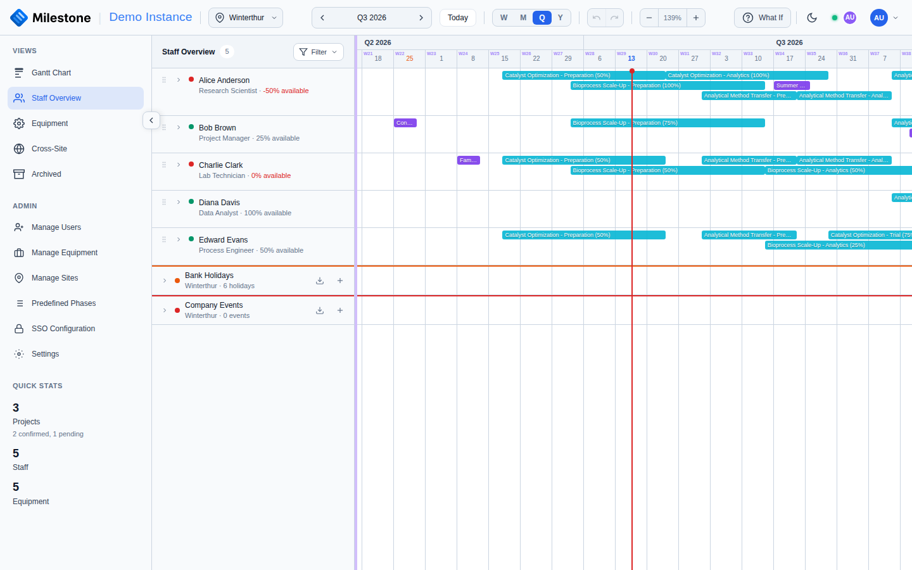

# Staff Management

The **Staff Overview** provides a timeline view centered on people rather than projects. It shows each staff member's assignments, availability, and time off.

{ loading=lazy }

!!! tip
    Admins and superusers can dock the Staff Overview directly below the Gantt chart via the **Panels** button — see [Resource Panels](gantt-charts.md#resource-panels).

## Staff List Panel

The left panel shows all staff members with:

- **Status indicator**: Green (available) or Red (overallocated)
- **Part-time badge**: Shows maximum capacity if less than 100%
- **Role and allocation**: Job title and current total allocation percentage
- **Drag handle**: Admins can drag staff onto the timeline to create assignments

Click the arrow to expand a staff member and see their vacation entries, recurring absences, and current project assignments.

## Staff Timeline

The right side shows a horizontal timeline with:

- **Assignment bars** — Colored by project, stacked when overlapping
- **Vacation blocks** — Distinct color/pattern
- **Workload indicator** — Thin bar showing total utilization level
- **Bank holidays and company events** — Expandable rows at the bottom

## Assigning Staff

### Method 1: Drag & Drop

1. Grab a staff member by the drag handle in the Staff Overview
2. Drag them onto a project/phase/subphase bar on the Gantt timeline
3. The Staff Assignment Modal opens pre-filled

### Method 2: Context Menu

1. Right-click on a project, phase, or subphase in the Gantt chart
2. Select **Assign Staff**
3. The Staff Assignment Modal opens

### Assignment Modal

- Select a **staff member** from the dropdown
- Set **allocation percentage** (5–100% in 5% increments)
- A warning appears if the assignment would exceed capacity
- Phase/subphase assignments inherit dates automatically
- Project-level assignments allow custom start/end dates

## Filtering Staff

Click the **Filter** dropdown to filter by:

- **Role** — Multi-select checkboxes (e.g., Research Scientist, Lab Technician)
- **Skills** — Multi-select with colored dots matching each skill's color
- **Clear All** — Reset all filters

The header shows filtered/total count (e.g., "12/20 staff") when filters are active.
