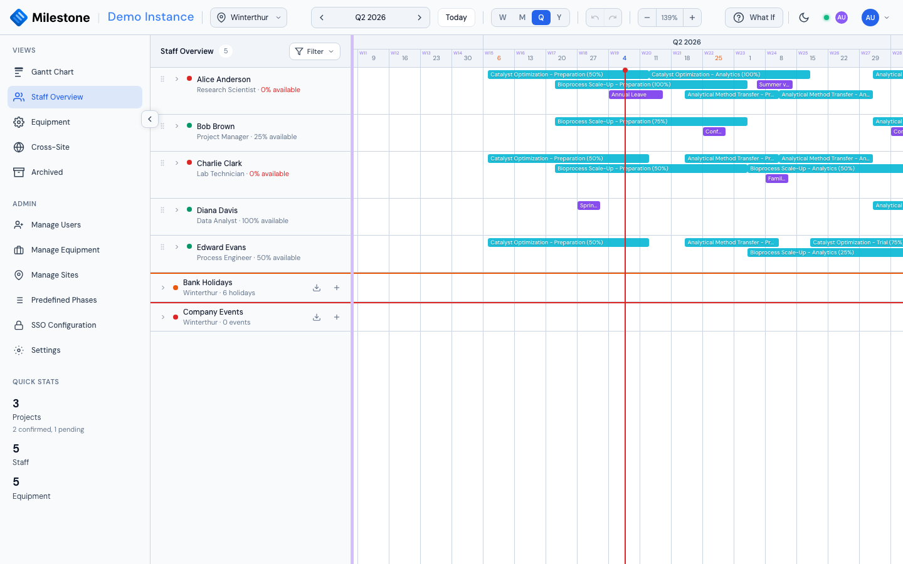

# Vacations & Time Off

Milestone tracks staff vacations and time off to provide accurate availability data in the Staff Overview.

{ loading=lazy }

## Creating Vacations

1. In the Staff Overview, expand a staff member and click **+ Add vacation/time off**
2. Set the **From** and **To** dates (duration is calculated automatically)
3. Optionally add a **description** (e.g., "Annual Leave", "Conference")
4. Click **Save**

Administrators can create vacations for any staff member by selecting from the dropdown.

## Recurring Absences

For regular part-time patterns (e.g., every Monday and Wednesday off):

1. Check **Recurring absence** in the Vacation Modal
2. Select the days of the week (Mon through Sun)
3. Click **Save**

Recurring patterns are shown with a repeat badge in the staff list and affect availability calculations on the selected days.

## Importing from Calendar (ICS)

Import vacation dates directly from Outlook or other calendar applications:

1. In the Vacation Modal, drag-and-drop an **.ics file** onto the upload zone (or click to browse)
2. Milestone parses the calendar events and displays them as a selectable list
3. Check/uncheck individual events
4. Click **Import** to create vacation entries for the selected events

The importer handles UTF-16 encoding (common with SAP calendar exports).

## Exporting to Outlook

Click **Save & Export** (instead of just Save) to download an **.ics file** that you can open in Outlook or any calendar app to sync the time-off to your personal calendar.
