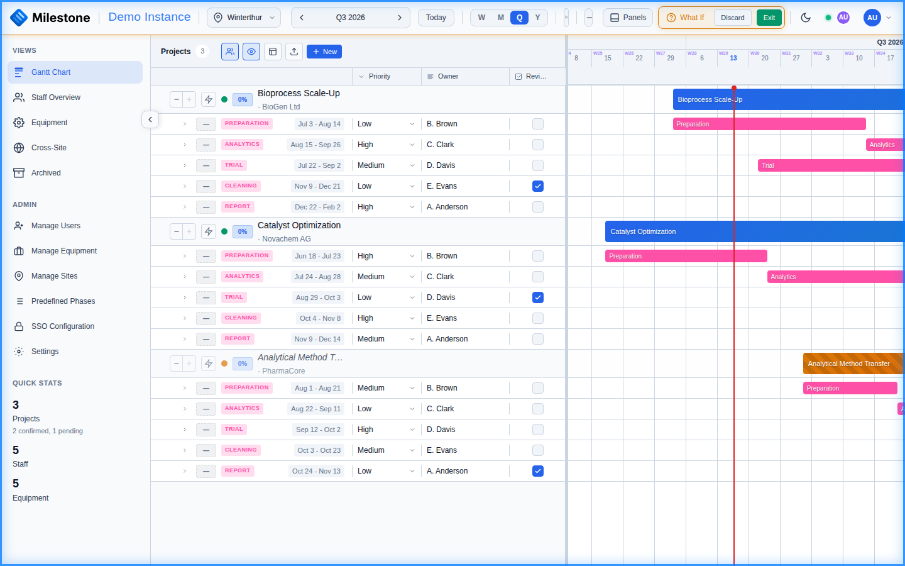

# What-If Planning

**What-If Mode** lets administrators and superusers experiment with scheduling changes without affecting the live data.

{ loading=lazy }

## How It Works

1. Click the **What-If** toggle in the header
2. The interface changes visually to remind you that you're in planning mode
3. Make any changes: move phases, reassign staff, adjust dates, etc.
4. Changes are **not saved to the database** — they exist only in your session
5. When done, choose:
   - **Commit changes** — Apply all What-If modifications to the live database
   - **Discard changes** — Reload original data, discarding all modifications

## Key Behaviors

- What-If is a **private sandbox**: your experimental changes stay in your browser and are *not* sent to the server or visible to other users until you commit them
- Changes are not persisted until explicitly committed
- Only administrators and superusers can enter What-If mode
- The visual appearance changes (header indicator) to remind you that you're in planning mode
- Importing a Microsoft Project file is blocked while What-If mode is active — imports cannot be sandboxed, so exit What-If mode first

## Committing and Discarding

When you're finished experimenting:

- **Commit changes** — All modifications made during the What-If session are saved to the database in a single batch. This includes moved phases, reassigned staff, date changes, and any other edits. Once committed, changes become the live data visible to all users.
- **Discard changes** — All modifications are thrown away and the original data is reloaded from the database. No trace of the What-If session remains.

!!! warning
    Committing cannot be undone. Review your changes carefully before committing, especially if multiple phases or assignments were modified.

## Use Cases

- Test resource reallocation before committing
- Explore "what happens if we move Project X to Q3?"
- Plan team changes without disrupting the live schedule
- Present planning options to stakeholders before deciding
- Run capacity scenarios during planning meetings — commit only the option the team agrees on
